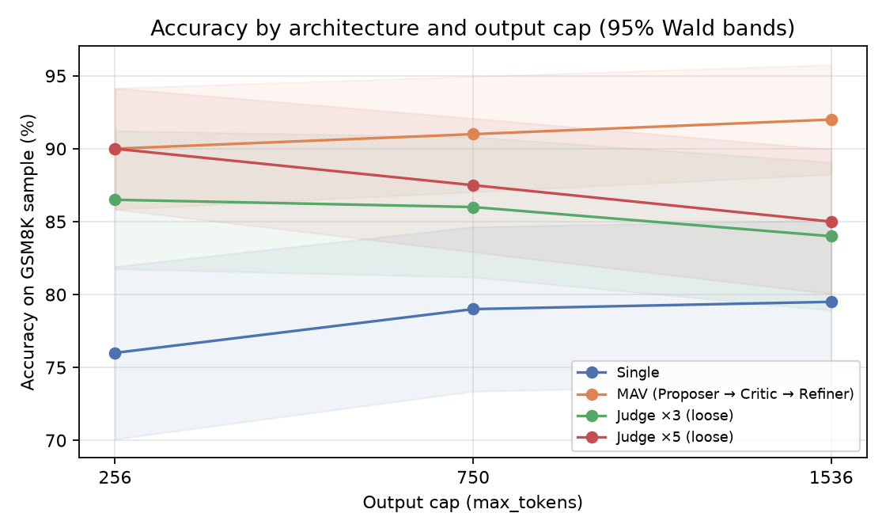
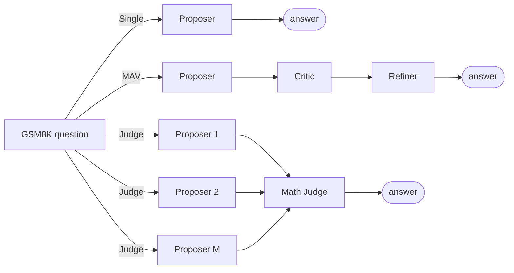
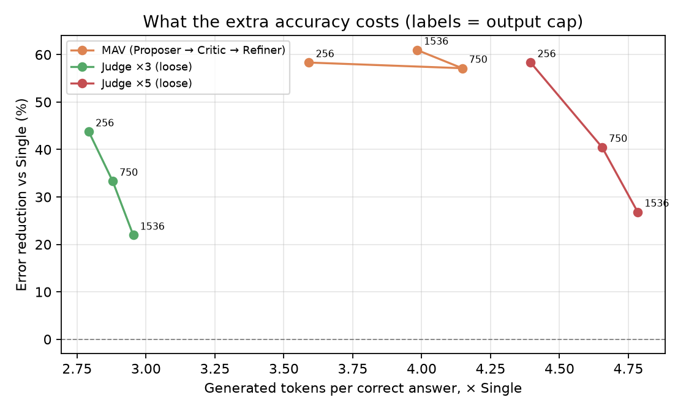

# Multi-agent collaboration for mathematical reasoning

[](https://github.com/diegomadriz/multi-agent-math-reasoning/actions/workflows/ci.yml)  [](LICENSE)

Does it pay to have an LLM critique and revise its own answer, or to sample several answers and let a judge pick one, and what does that cost in extra compute?

This repo compares single-agent and multi-agent ways of orchestrating **one local model** (Qwen2.5-7B-Instruct, 4-bit GGUF, llama.cpp on an M1 Pro) on a fixed 200-question GSM8K sample. Each run varies the output cap, scores answers by exact match, and reports cost **per correct answer**, not just accuracy.

**Headline:** at a 1,536-token cap per call, Proposer → Critic → Refiner (MAV) reached **92.0%** vs **79.5%** for a single call, a **61% relative error reduction**. It cost **3.98×** the generated tokens and **4.46×** the time per correct answer.



Interactive walkthrough: [diegoramirezmadriz.dev/projects/multi-agent-mathematical-reasoning](https://www.diegoramirezmadriz.dev/projects/multi-agent-mathematical-reasoning) · Full write-up: [`report/MultiAgentResearchFinalReport.pdf`](report/MultiAgentResearchFinalReport.pdf)

## Architectures



All roles are the same model with different prompts, so differences come from the orchestration and not from mixing models.

| Mode | Calls | How the output cap is applied |
|---|---|---|
| `single` | 1 | the full cap |
| `mav` | 3 | the full cap on each of Proposer, Critic, Refiner |
| `prop_judge_M{3,5}_loose` | M + 1 | the full cap per Proposer; the Judge gets 64 tokens |
| `prop_judge_M{3,5}_strict` | M + 1 | all calls share the cap: `floor(cap / (M + 1))` each |

The same nominal cap therefore means different total compute in each mode. That's why the comparison is made on tokens and seconds **per correct answer**.

## Results

Accuracy on the same 200 GSM8K questions (train split, `random_state=42`):

| Architecture | Cap 256 | Cap 750 | Cap 1,536 |
|---|---:|---:|---:|
| Single | 76.0% | 79.0% | 79.5% |
| MAV | 90.0% | 91.0% | 92.0% |
| Judge ×3, loose | 86.5% | 86.0% | 84.0% |
| Judge ×5, loose | 90.0% | 87.5% | 85.0% |
| Judge ×3, strict | 47.0% | 83.5% | 85.0% |
| Judge ×5, strict | 35.0% | 75.5% | 88.0% |

What the numbers say:

- **MAV is the most accurate at every cap** (57–61% error reduction vs Single) and improves as the cap grows.
- **The loose Judge variants get *worse* as the cap grows.** More room per candidate didn't make selection better.
- **Splitting a small shared allowance backfires.** Strict Judge at cap 256 gives each call 64 or 42 tokens and falls far below Single (47% and 35% vs 76%).
- **Nothing is free.** Every multi-agent mode costs roughly 2.8–4.8× Single's tokens per correct answer.



Data: [`results/benchmark_token_budget_summary.csv`](results/benchmark_token_budget_summary.csv) (all 18 configurations), [`results/table_main_results.tex`](results/table_main_results.tex) (the report table), and [`results/pilot_n25/`](results/pilot_n25) (the earlier 25-question pilot, with per-item predictions).

## Quickstart

```bash
git clone https://github.com/diegomadriz/multi-agent-math-reasoning.git
cd multi-agent-math-reasoning
python -m venv .venv && source .venv/bin/activate
pip install -e ".[dev]"
pytest                       # 26 tests, no model needed
```

**Rebuild the tables and figures from the published results** (no model or GPU needed):

```bash
mam analyze results/benchmark_token_budget_summary.csv --n 200 --out figures
```

**Run the models yourself** (needs the ~4.7 GB GGUF model):

```bash
pip install -e ".[llama,data]" huggingface_hub
hf download Qwen/Qwen2.5-7B-Instruct-GGUF \
  --include "qwen2.5-7b-instruct-q4_k_m*.gguf" --local-dir models

# One question, every call printed
mam ask "A factory makes 120 widgets an hour for 8 hours, 5 days a week. Each needs 3 screws and a box holds 360. How many boxes per week?" \
  --model models/qwen2.5-7b-instruct-q4_k_m-00001-of-00002.gguf --arch mav

# Full sweep (same sample as the reported run). Writes items.csv, summary.csv, transcripts.jsonl, config.json
mam bench --model models/qwen2.5-7b-instruct-q4_k_m-00001-of-00002.gguf --n 200 --gen-seed 0
```

The full sweep is 18 configurations × 200 questions and takes many hours on a laptop. Use `--n 20 --budgets 256` for a quick check, and `--split test` for new studies.

## How it's built

```
src/multiagent_math/
  prompts.py        role prompts, verbatim from the experiment
  llm.py            llama.cpp backend + timed calls (tokens, latency)
  architectures.py  single / MAV / proposers+judge, with cap allocation
  scoring.py        "#### <number>" parsing and exact-match scoring
  data.py           deterministic GSM8K sampling
  metrics.py        accuracy, Wald intervals, error reduction, cost per correct answer
  plots.py, cli.py  figures and the `mam` command
notebooks/original_experiment.ipynb   the notebook that produced the reported results, with its outputs
tests/                                unit tests + fidelity checks against the original run
results/  figures/  report/            published data, README figures, the final report (PDF)
```

The original work was a single research notebook. This package extracts it into reusable code, and the tests keep the two consistent:

- `test_prompt_fidelity.py` runs the prompt-building code from the notebook and checks that the package produces **byte-identical** prompts and the same judge decoding settings.
- `test_metrics.py` recomputes the reported numbers (accuracy intervals, error reduction, cost multipliers) from the saved summary and checks them against the report's table.
- The same test file checks that the accuracy matrix printed in the notebook matches `results/`, so the published CSV is the notebook's own output.
- `test_data_and_cli.py` checks that sampling reproduces the pilot's exact question set (when GSM8K is cached locally).

Compared with the notebook, `mam bench` also saves what the original run didn't: per-item predictions (written as they finish, so an interrupted sweep keeps its results), full call transcripts, an optional generation seed, and the run configuration with library versions.

## Limitations

Stated plainly, because they bound what the results can claim:

- **One sample, one run.** 200 questions from the GSM8K *train* split, one stochastic run per configuration, no generation seed. The original 200-item sweep kept only aggregates, so there are no paired per-item comparisons or significance tests. Intervals are pointwise Wald bands, and many of them overlap.
- **Unequal compute by design.** A nominal cap is not equal total compute across modes. Read accuracy together with cost per correct answer.
- **Narrow scoring.** Exact match on the first `#### <number>`. Commas (`1,000`), fractions and scientific notation aren't parsed. Reasoning quality isn't graded.
- **Hardware-specific timing.** Latency is wall-clock on one M1 Pro. Input tokens, memory and energy weren't measured.
- **One model.** Results may not transfer to other models, sizes or quantizations.

A natural next step is a seeded, repeated, paired rerun on the test split. `mam bench` already records everything that needs.

## About

Supervised research assignment at Universitat Politècnica de Catalunya (exchange semester, Fall 2025) by **Diego Ramirez Madriz**. I designed and ran the experiment and the analysis: local inference setup, role prompts, the Single/MAV/Judge orchestration, scoring, the benchmark sweep and the figures. The reusable package was extracted from the original notebook in 2026.

Portfolio: [diegoramirezmadriz.dev](https://www.diegoramirezmadriz.dev) · License: [MIT](LICENSE) · Cite: [`CITATION.cff`](CITATION.cff)
